<div align="center">



<a href="https://dhruv-port-folio.netlify.app">
  
</a>

<br/>

[](https://dhruv-port-folio.netlify.app)
[](https://linkedin.com/in/dhruv-mishra-713945359)
[](mailto:dhruvmh50@gmail.com)
[](https://leetcode.com/u/dhruv___mishra)
[](https://codechef.com/users/dhruv_905)
[](https://instagram.com/_dhruv___mishra)

</div>

<br/>

## `>_ BOOT.SEQUENCE`

```js
const dhruv = {
  identity : "B.Tech CSE (AI & ML) | Web Developer | Python Developer",
  base     : "Ranchi, India",
  building : ["EverHeal", "AI/ML systems"],
  learning : ["React", "Node.js", "DSA", "Machine Learning"],
  seeking  : ["Backend architecture", "System Design", "ML mentorship"],
  open_to  : ["Web", "AI/ML", "Open Source collaboration"],
  ask_me   : ["Python", "C", "Java", "React", "Flask"],
  fuel     : "caffeine, compilers, curiosity *_*"
};
```

<br/>

## `// CORE.MODULES`

<table align="center">
<tr>
<td width="33%" valign="top">

**[ 01 ] FULL-STACK SYSTEMS**

React, Flask, Node.js and REST APIs wired into fast, deployable products.

</td>
<td width="33%" valign="top">

**[ 02 ] VISION + INTELLIGENCE**

OpenCV pipelines, face recognition and applied machine learning.

</td>
<td width="33%" valign="top">

**[ 03 ] LEADERSHIP + EXECUTION**

Team lead at the EDC College Competition. Round 2 finalist at SIH 2025.

</td>
</tr>
</table>

<br/>

## `// DEPLOYED.BUILDS`

| MODULE | STACK | WHAT IT DOES | LINKS |
| :--- | :--- | :--- | :--- |
| **EverHeal** | HTML / CSS / JavaScript | Healthcare consultation platform with a redesigned patient and doctor experience. Led the team to Round 2 of the EDC College Competition. | [source](https://github.com/Dhruv-Mishra-905/EverHeal) / [live](https://everheal.netlify.app) |
| **Crypto Tracker** | React / REST APIs / Bootstrap | Real-time cryptocurrency prices, trends and market data in a clean dashboard. | [source](https://github.com/Dhruv-Mishra-905/react-project-hub) / [live](https://simplecryptotracker.netlify.app) |
| **SVMS** | Python / Flask / SQLite / ReportLab | Society visitor management with check-in flows, admin dashboards and PDF records. Built during the CCL internship. | [source](https://github.com/Dhruv-Mishra-905/Main-Projects) / [live](https://society-visitor-management-system.onrender.com) |
| **Face Recognition Attendance** | Python / OpenCV | Automated attendance through live face recognition. Advanced to Round 2 of Smart India Hackathon 2025. | [source](https://github.com/Dhruv-Mishra-905/Python-Projects) |
| **Color Detection** | Python / OpenCV | Detects and classifies colors through pixel and color-range analysis. | [source](https://github.com/Dhruv-Mishra-905/Python-Projects) |

<br/>

## `// FIELD.EXPERIENCE`

```text
[ MAY 2026 - JUN 2026 ]  Software Development Intern  ::  Smart Network Analytics Center, Usha Martin
                         > Real-time network analytics dashboard components and data visualization

[ JUN 2026 - JUL 2026 ]  Software Development Intern  ::  Central Coalfields Limited
                         > Frontend and backend of the Society Visitor Management System
```

<br/>

## `// TECH.ARSENAL`

<div align="center">

**LANGUAGES**<br/>


**WEB + FRAMEWORKS**<br/>


**AI / ML + DATA**<br/>


**CLOUD + TOOLING**<br/>


</div>

<br/>

## `// LIVE.TELEMETRY`

<div align="center">


</div>

<br/>

<div align="center">

[](https://buymeacoffee.com/_dhruv___mishra)


</div>
